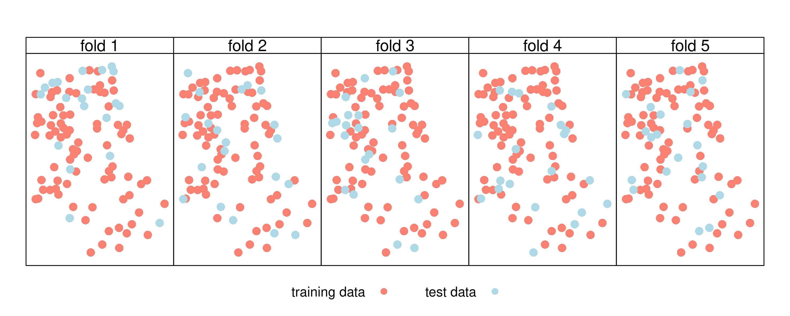
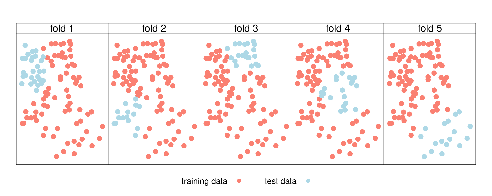

```{r setup, include = FALSE}
options(htmltools.dir.version = FALSE)
library(RefManageR)
BibOptions(check.entries = FALSE, 
           bib.style = "authoryear", 
           cite.style = 'alphabetic', 
           style = "markdown",
           first.inits = FALSE,
           hyperlink = FALSE, 
           dashed = FALSE)
my_bib = ReadBib("../../xaringan_stuff/references.bib", check = FALSE)
```


layout: true
background-image: url(../../xaringan_stuff/img/r_geocomp_background.png)
background-size: cover

---

# Find the slides and code
<br>
<br>
<br>
<br>
https://github.com/geocompr/geostats_18

<br>
<br>
Please install following packages:
```{r, eval=FALSE}
list_of_packages = c("sf", "raster", "mlr", "RQGIS", "parallelMap")
install.packages(list_of_packages)
```


---
layout: false

# Contents of the tutorial

```{r, eval=FALSE, echo=FALSE}
library(sf)
library(spData)
world_laea = st_transform(world, 
                          crs = "+proj=laea +x_0=0 +y_0=0 +lon_0=-77 +lat_0=39")
gr = st_graticule(ndiscr = 1000) %>%
  st_transform("+proj=laea +y_0=0 +lon_0=-77 +lat_0=39 +ellps=WGS84 +no_defs")
png(filename = "pres/img/globe.png")
plot(gr$geometry, col = "lightgray", lwd = 3)
plot(world_laea$geom, bg = "white", col = "lightgray", add = TRUE)
dev.off()
```

<figure>

</figure>


1. (Spatial) cross-validation
--

1. **mlr** building blocks by example
--

1. Real-world example...
--

---

layout: true
background-image: url(../../xaringan_stuff/img/r_geocomp_background.png)
background-size: cover

---
class: inverse, center, middle

# Study area, data and aim

---

# Study area

Where are we? Mount Mongón near Casma in northern Peru.
<center>
<figure>

</figure>
</center>
---
# Austral summer

<center>
<figure>

</figure>
</center>
---

# Mount Mongón in summer

<center>
<figure>

</figure>
</center>

---

# Mount Mongón in austral winter

<center>
<figure>

</figure>
</center>
---

# Data

.pull-left[
- 100 randomly distributed plots
- coverage of all vascular plants in each plot
- First NMDS axis represents the main gradient (our response, see Chapter 14 of [*Geocomputation with R*](https://geocompr.robinlovelace.net/) `r Citep(my_bib, "lovelace_geocomputation_2018", .opts = list(cite.style = "authoryear"))`
]


.pull-right[
```{r, echo=FALSE, message = FALSE}
library("latticeExtra")
library("grid")
library("sf")
library("raster")

# attach the data
data("study_area", "random_points", "comm", "dem", "ndvi", package = "RQGIS")
# create hillshade
hs = hillShade(terrain(dem), terrain(dem, "aspect"))
p_1 = spplot(dem, col.regions = terrain.colors(50), alpha.regions = 0.5,
       scales = list(draw = TRUE,
                     tck = c(1, 0)),
       colorkey = list(space = "right", title = "m asl",
                               width = 0.5, height = 0.5,
                       axis.line = list(col = "black")),
       sp.layout = list(
         list("sp.points", as(random_points, "Spatial"), pch = 16,
              col = "black", cex = 1.25, first = FALSE),
         list("sp.polygons", as(study_area, "Spatial"), 
              col = "black", lwd = 1.5, first = FALSE)
       )
       ) + 
  latticeExtra::as.layer(spplot(hs, col.regions = gray(0:100 / 100)), 
                         under = TRUE)
print(p_1)
grid.text("m asl", x = unit(0.95, "npc"), y = unit(0.75, "npc"), 
          gp = gpar(cex = 1))
```
]

---

# Aim

.pull-left[
- model the floristic gradient as a function of environmental predictors using a random forest model
- spatial cross-validation to retrieve a bias-reduced estimate of the model's performance
- tune hyperparameters for the predictive mapping of the floristic gradient
- but before we do that, we will introduce the **mlr** building blocks to easily do spatial cross-validation with a simple `lm` (though this definitely is not be the most appropriate model for our data...)
]

.pull-right[
```{r, echo=FALSE, message = FALSE}
print(p_1)
grid.text("m asl", x = unit(0.95, "npc"), y = unit(0.75, "npc"), 
          gp = gpar(cex = 1))
```
]


---
class: inverse, center, middle

# (Spatial) cross-validation

---

# Cross-validation

---

# Random partitioning

<figure>


---

# Spatial partitioning


<figure>

</figure>


---


---
class: inverse, center, middle

# **mlr** building blocks

---

# Building blocks

<center>
<figure>

</figure>
</center>

---

# Input data
```{r, echo=FALSE, message=FALSE}
library(mlr)
library(dplyr)
library(sf)
rp = readRDS("../../code/spatial_cv/images/rp.rds")
# extract the coordinates into a separate dataframe
coords = sf::st_coordinates(rp) %>%
  as.data.frame %>%
  rename(x = X, y = Y)
# only keep response and predictors which should be used for the modeling
rp = dplyr::select(rp, -id, -spri) %>%
  st_set_geometry(NULL)
```

We are already in possession of the following data

```{r, message=FALSE}
library(mlr)
library(dplyr)
library(sf)
# response-predictor dataframe
head(rp, 2)
# coordinates
head(coords, 2)
```

---

# Little data exploration

<center>
```{r, echo=FALSE, out.width="65%"}
# first have a look at the data
d = reshape2::melt(rp, id.vars = "sc")
xyplot(sc ~ value | variable, data = d, pch = 21, fill = "lightblue", cex = 1.5,
       col = "black", ylab = "response (sc)", xlab = "predictors",
       scales = list(x = "free", 
                     tck = c(1, 0),
                     alternating = c(1, 0)),
       strip = strip.custom(bg = c("white"),
                            par.strip.text = list(cex = 1.2)),
       panel = function(x, y, ...) {
         panel.points(x, y, ...)
         panel.loess(x, y, col = "salmon", span = 0.5, lwd = 2)
       })
```
</center>

---

# Create a task
```{r}
library(mlr)
# create task
task = makeRegrTask(data = rp, target = "sc",
                    coordinates = coords)
```

---

# Learner

To find out which learners are available for a specific task run:

```{r, eval=FALSE}
lrns = listLearners(task, warn.missing.packages = FALSE)
dplyr::select(lrns, class, name, short.name, package)
```

--
We already know that there is a learner named `regr.lm` for running a simple linear model.

---

# Define the learner

```{r}
lrn = makeLearner(cl = "regr.lm", predict.type = "response")
```

--
To find out more about the learner, run:

```{r, eval=FALSE}
# simple lm of the stats package
getLearnerPackages(lrn)
helpLearner(lrn)
```

--
Just to convince you that we are really using a simple `lm`, let us retrieve the learner model:

```{r}
getLearnerModel(train(lrn, task))
```

---

# Define spatial partitioning
```{r}
# performance level
perf_level = makeResampleDesc(method = "SpRepCV", 
                              folds = 5, 
                              reps = 100)
```

--

<center>
<figure>

</figure>
</center>
---

# Execute the resampling
```{r, cache=TRUE}
cv_sp = mlr::resample(
  task = task,
  learner = lrn,
  resampling = perf_level, 
  # specify the performance measure
  measures = mlr::rmse)
# boxplot(cv_sp$measures.test$rmse)
```
???
```{r, eval=FALSE, echo=FALSE}
# we can run the same using a conventional cross-validation
# task_nsp = makeRegrTask(data = rp, target = "sc")
# perf_level_nsp = makeResampleDesc(method = "RepCV", folds = 5, reps = 100)
# cv_nsp = mlr::resample(learner = lrn, 
#                       task = task_nsp,
#                       resampling = perf_level_nsp, 
#                       measures = mlr::rmse)
# boxplot(cv_sp$measures.test$rmse, cv_nsp$measures.test$rmse,
#         col = c("lightblue2", "mistyrose2"),
#         names = c("spatial CV", "conventional CV"),
#         ylab = "RMSE")
```
---

# Have a look at the result
```{r}
cv_sp
```

Ok, is this good or not?
--
```{r}
range(rp$sc)
```
--

Hence, this corresponds to a mean deviation from the true value of (%):

```{r}
cv_sp$aggr / diff(range(rp$sc)) * 100
```
???
Admittedly, better than expected... but can we do better?
---
class: inverse, center, middle

# Random forests

---

# Random forests
Like many other machine learning algorithms, random forests have hyperparameters `r Citep(my_bib, "james_introduction_2013", .opts = list(cite.style = "authoryear"))`. 
These hyperparameters are not estimated from the data like the coefficients of (semi-)parametric models (`lm`, `glm`, `gam`) but need to be specified before the learning begins. 
To find the optimal hyperparameters, one needs to run many models using random hyperparameter values.
There are several approaches how to do this, here, we will use a random search with 50 iterations while we limit the tuning space to a specific range in accordance with the literature `r Citep(my_bib, "probst_hyperparameters_2018","schratz_performance_2018", .opts = list(cite.style = "authoryear"))`.


# Hyperparameter tuning
---

# Random search  

---

# Next slide

`r Citep(my_bib, "bivand_implementing_2000", .opts = list(cite.style = "authoryear"))`.


---

class: small
# References

```{r, 'refs', results="asis", echo=FALSE}
PrintBibliography(my_bib)
```

